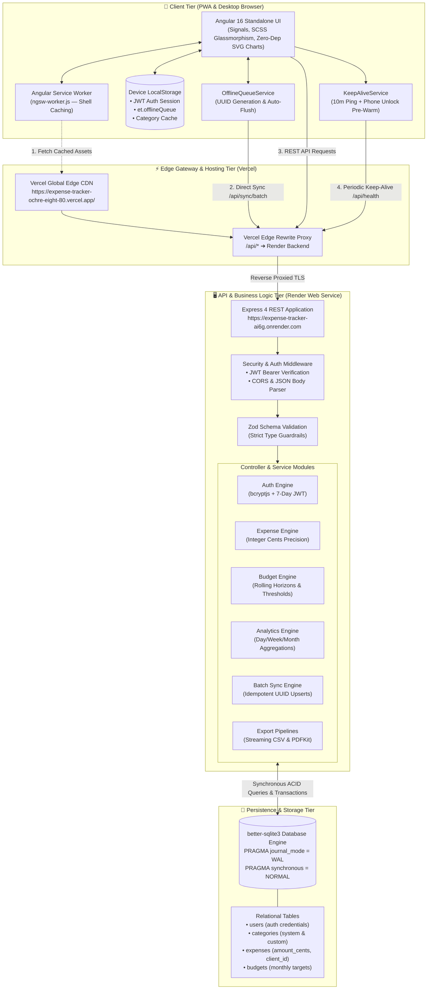
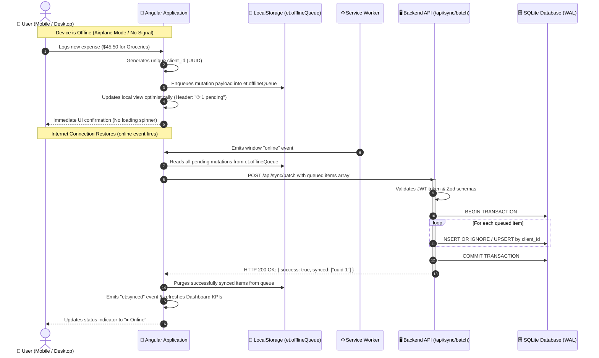

<div align="center">

# ⚡ Expense Tracker & Financial Analytics

[](https://expense-tracker-ochre-eight-80.vercel.app/)
[](https://web.dev/progressive-web-apps/)
[](#-offline-first-support-does-it-require-internet)
[](https://angular.io/)
[](https://nodejs.org/)
[-003B57?style=for-the-badge&logo=sqlite&logoColor=white)](https://sqlite.org/)
[](LICENSE)

<br />

**A full-stack, offline-first personal financial management platform built with Angular 16, Node.js/Express, SQLite WAL, and Progressive Web App (PWA) architecture. Features integer-cent precision, interactive 7-step guided onboarding, dynamic financial trends, and automatic background sync.**

<br />

### 🌐 [👉 Click Here to Open Live Application](https://expense-tracker-ochre-eight-80.vercel.app/)

**Live Link:** [https://expense-tracker-ochre-eight-80.vercel.app/](https://expense-tracker-ochre-eight-80.vercel.app/)  
**Demo Account:** `demo@expense.test` / `demo1234`

<br />

[🚀 Live App](https://expense-tracker-ochre-eight-80.vercel.app/) • [📱 Mobile & PWA](#-mobile-app--pwa-installation) • [🌐 Offline Support](#-offline-first-support-does-it-require-internet) • [✨ Guided Tour](#-interactive-guided-tour) • [Architecture](#-architecture--system-flow) • [Quickstart](#-quickstart) • [API Reference](#-api-endpoint-reference)

</div>

---

## 📱 Mobile App & PWA Installation

This application is a full **Progressive Web App (PWA)** that can be installed directly onto your iPhone, Android device, or desktop without an App Store or Play Store download. It runs **full-screen with zero browser address bar**, native splash screens, and custom high-resolution icons.

### 📲 How to Install on Android (Chrome / Brave / Edge)
1. Open [https://expense-tracker-ochre-eight-80.vercel.app/](https://expense-tracker-ochre-eight-80.vercel.app/) in Chrome.
2. Tap the **📲 Install** button in the top navigation bar (or choose **"Add to Home screen"** from Chrome's three-dot menu `⋮`).
3. Tap **Install** — the app icon will appear on your home screen and in your app drawer!

### 🍏 How to Install on iPhone (Safari)
1. Open [https://expense-tracker-ochre-eight-80.vercel.app/](https://expense-tracker-ochre-eight-80.vercel.app/) in **Safari**.
2. Tap the **Share** button (box with an upward arrow `⎋`) at the bottom of the screen.
3. Scroll down and tap **"Add to Home Screen"** (`⊞`).
4. Tap **Add** in the top right corner.
5. Tap the new **ExpenseTracker** app icon on your home screen to launch in full-screen standalone mode!

---

## 🌐 Offline-First Support: Does It Require Internet?

### **Short Answer: NO! Once logged in, the app does NOT require an internet connection.**

The app uses an **offline-first local-storage queue architecture**:

| Action | Without Internet (Offline) | When Internet Returns (Online) |
|---|---|---|
| **Opening App** | Launches in `<0.3s` from device cache via Service Worker (`ngsw-worker.js`) | Always loads from local cache |
| **Authentication** | You remain permanently logged in (`localStorage` session persistence) | Token verified in background |
| **Viewing Dashboard** | All your loaded expenses, categories, KPIs, and budgets display instantly | Silently syncs with server |
| **Status Banner** | Header indicates `● Offline — saving locally` | Standard controls displayed |
| **Logging Expenses** | Allowed! Automatically queued in `et.offlineQueue`, header shows `⟳ X pending` | Automatically flushed to `/api/sync/batch` |
| **Cloud Sync** | Queue safely survives phone reboots and app closures | Merged into SQLite DB idempotently; UI refreshes |

> *Note: Only the very first registration (creating a new account for the first time) requires internet to reach the database.*

---

## ⚡ Zero Cold-Start Lag (Keep-Alive Heartbeat)

On free cloud hosting tiers (like Render), backend servers typically spin down into deep sleep after 15 minutes of inactivity. We engineered a dual-layer keep-alive solution in `KeepAliveService`:
1. **Automated 10-Minute Heartbeat**: While the app or browser tab is open, the app sends a lightweight `/api/health` ping every 10 minutes, resetting the inactivity timer so **the server never spins down**.
2. **Instant Pre-Warm on Phone Unlock**: The instant you unlock your phone or switch back to the app (`visibilitychange` / `focus`), a background pre-warming request is fired immediately, ensuring the server is hot before you even tap an action.

---

## ✨ Interactive Guided Tour (Mobile & Desktop)

Tap the **✨ Tour** button in the header at any time to launch a 7-step interactive walkthrough:
1. **✨ 1 · Log Expenses & Income**: Add transactions with categories, dates, and notes.
2. **📅 2 · Date Filters & Chart Views**: 1-click presets ("Today", "This week", "This month") and grouping.
3. **📊 3 · Deep Spending Breakdown**: Inspect spending by Day of Week, Week, Month, or Year.
4. **↕️ 4 · Sorting & Quick Edits**: Ascending/descending sorting by Date and Amount.
5. **📋 5 · Full Transactions Hub**: Search receipts, filter by range, and paginate.
6. **◑ 6 · Smart Budget Guardrails**: Color-coded gauges with 80%, 90%, and 100% threshold warnings.
7. **⤓ 7 · Instant PDF & CSV Reports**: Download spreadsheets and PDF reports anytime.

*Mobile Optimized: On smartphones, the tour docks as an ergonomic bottom sheet (or top card for bottom-bar navigation), smoothly auto-scrolling with 60fps tracking and zero extra taps required.*

---

## 🚀 Key Features

- **Progressive Web App (PWA)**: Installable, full-screen standalone mobile experience with high-resolution app icons.
- **Offline-First Resilience**: Log expenses offline; automatic background batch synchronization with idempotent UUIDs.
- **Dynamic 10-Year Rolling Horizon**: Auto-updating rolling calendar horizon dynamically recalculating from system time.
- **High-Precision Financial Engine**: All monetary calculations execute with integer cents (`amount_cents`) to eliminate IEEE-754 floating-point inaccuracies.
- **Zero-Dependency SVG Charts**: Hand-rolled SVG trend polylines, category distribution bars, and donut charts.
- **Budget Threshold Alerts**: Real-time multi-tier threshold indicators (`safe` < 80%, `warning` 80-99%, `exceeded` ≥ 100%).
- **Streaming Export Pipelines**: Server-side streamed CSV via `fast-csv` and formatted PDF summaries via `pdfkit`.
- **Zero Inactivity Lag**: Automated keep-alive pinging prevents cloud instance sleep.

---

## 🏛️ Architecture & System Flow

The Expense Tracker & Financial Analytics platform is built as an **offline-resilient, tiered Progressive Web App (PWA)** backed by a high-throughput Node.js micro-service and an ACID-compliant SQLite WAL database.

### 📐 High-Level End-to-End System Architecture



### 📦 Structural Block Diagram

```text
+---------------------------------------------------------------------------------------------------+
|                                  CLIENT LAYER (iOS / Android / Desktop)                           |
|                                                                                                   |
|  +---------------------------+   +-----------------------------+   +---------------------------+  |
|  |   Angular 16 UI Shell     |   |   Offline Queue Manager     |   |   Keep-Alive Monitor      |  |
|  | - Standalone Components   |   | - Client-generated UUIDs    |   | - 10-minute ping loop     |  |
|  | - Reactive Signals & SVG  |   | - LocalStorage persistence  |   | - Phone unlock pre-warm   |  |
|  | - Safe Area Mobile Nav    |   | - Auto-reconnect flush      |   | - Zero cold-start latency |  |
|  +-------------+-------------+   +--------------+--------------+   +-------------+-------------+  |
|                |                                |                                |                |
|                +--------------------------------+--------------------------------+                |
|                                                 |                                                 |
|                               +-----------------+-----------------+                               |
|                               |  Service Worker (ngsw-worker.js)  |                               |
|                               | - Instant <0.3s cache loading     |                               |
|                               | - Offline asset delivery          |                               |
|                               +-----------------+-----------------+                               |
+-------------------------------------------------|-------------------------------------------------+
                                                  | HTTPS Requests
                                                  v
+---------------------------------------------------------------------------------------------------+
|                             EDGE GATEWAY (Vercel Global CDN)                                      |
|                                                                                                   |
|  • Serves Production Static SPA Bundle (HTML, JS, CSS, Web App Manifest)                         |
|  • Reverse-Proxy Route Rules: /api/*  ===>  https://expense-tracker-ai6g.onrender.com/api/*      |
+-------------------------------------------------|-------------------------------------------------+
                                                  | Proxied HTTP / REST
                                                  v
+---------------------------------------------------------------------------------------------------+
|                        APPLICATION LAYER (Node.js 18+ / Express 4 on Render)                      |
|                                                                                                   |
|  [ Middlewares ]  CORS Headers  -->  JSON Parser  -->  JWT Bearer Authentication                  |
|                                                                                                   |
|  [ Validation ]   Strict Zod Schemas on every mutation payload                                    |
|                                                                                                   |
|  [ REST API Modules ]                                                                             |
|  ├── /api/auth          : Signup, Login (bcrypt hashed), Token Verification                       |
|  ├── /api/categories    : System defaults + User-defined custom categories                        |
|  ├── /api/expenses      : CRUD with integer-cent accuracy & 1-tap sample seed                     |
|  ├── /api/budgets       : Dynamic threshold calculation (<80% Safe, 80-99% Warning, ≥100% Limit) |
|  ├── /api/analytics     : Rolling trends, week-over-week comparisons, category breakdown         |
|  ├── /api/sync/batch    : Idempotent bulk sync handling offline uploads with client_id dedupe     |
|  ├── /api/export/*      : Memory-safe CSV streaming (fast-csv) & multi-page PDF summary (pdfkit)  |
|  └── /api/health        : Lightweight heartbeat endpoint preventing free-tier sleep               |
+-------------------------------------------------|-------------------------------------------------+
                                                  | Synchronous C++ Binding
                                                  v
+---------------------------------------------------------------------------------------------------+
|                               DATA LAYER (better-sqlite3 WAL Mode)                                |
|                                                                                                   |
|  • File-backed SQLite database with Write-Ahead Logging (WAL) for high concurrency reads & writes |
|  • Integer cents storage (`amount_cents`) eliminates IEEE-754 floating point rounding errors      |
|  • Relational schema with Foreign Key cascading deletions and performance indexes                 |
|    - idx_expenses_user_date (user_id, date DESC)                                                  |
|    - idx_expenses_client_id (client_id UNIQUE per user)                                           |
|    - idx_budgets_user_month (user_id, month, category_id)                                         |
+---------------------------------------------------------------------------------------------------+
```

---

### 🔄 Offline-First Synchronization Lifecycle

When working offline on a mobile device or desktop without internet connectivity, the application guarantees zero data loss using client-side queuing and idempotent server synchronization:



---

## 🛠️ Tech Stack

| Layer | Technology | Notes |
|---|---|---|
| Frontend | **Angular 16.2 (Standalone)** | Standalone components, signals, `effect()`, lazy routes, functional interceptors |
| PWA & Offline | **@angular/service-worker** | Static shell caching, Web App Manifest, auto-update notifier |
| UI Styling | **Custom SCSS Design System** | Dark/Light themes, glassmorphism, responsive bottom nav, iOS safe areas |
| Charts | **Hand-rolled SVG** | Zero external chart libraries; pure responsive SVG mathematics |
| Backend | **Node.js + Express 4** | Modular architecture (auth, categories, expenses, budgets, analytics, export, sync) |
| Database | **better-sqlite3** | Synchronous WAL mode, auto-indexing, ACID compliance |
| Validation | **zod** | Strict schema validation with human-readable error messages |
| Exports | **fast-csv & pdfkit** | Constant-memory streaming CSV and executive multi-page PDF generation |
| Auth | **jsonwebtoken + bcryptjs** | 7-day JWT, persistent session storage in localStorage |

---

## ⚡ Quickstart

> 💡 **Prefer not to install locally?** Test the deployed application immediately in your browser or smartphone:  
> **👉 [Launch Live Working App](https://expense-tracker-ochre-eight-80.vercel.app/)** *(Instant Login: `demo@expense.test` / `demo1234`)*

```powershell
# ── Terminal 1: Backend (port 3001) ─────────────────────────────
cd expense-tracker\server
npm install
npm run db:init            # applies ..\db\schema.sql (idempotent, safe to rerun)
npm run db:seed            # creates demo user + 6 system categories
node src\seed.js --demo    # OPTIONAL: realistic expenses + budgets for current month
npm start                  # ✔ Expense Tracker API listening on http://localhost:3001

# ── Terminal 2: Frontend (port 4200) ────────────────────────────
cd expense-tracker\client
npm install
npm start                  # ✔ Compiled successfully → open http://localhost:4200
```

**Demo account:** `demo@expense.test` / `demo1234` (timezone `America/New_York`, seeded data included)

**Reset the database from scratch:**
```powershell
cd expense-tracker\db
Remove-Item expense-tracker.db, expense-tracker.db-wal, expense-tracker.db-shm -ErrorAction SilentlyContinue
cd ..\server
npm run db:init; npm run db:seed; node src\seed.js --demo
```

The Angular dev server proxies `/api/*` → `http://localhost:3001` using `client/proxy.conf.json`,
so the browser never sees CORS or token-less cross-origin calls in development.

---

## 3. Scripts & environment

### server/package.json
| Script | Command | Purpose |
|---|---|---|
| `npm start` | `node src/index.js` | Run API |
| `npm run dev` | `node --watch src/index.js` | Auto-restart on file changes |
| `npm run db:init` | `node src/db.js --init` | Create/apply schema |
| `npm run db:seed` | `node src/seed.js` | Demo user; add `--demo` for data |

### client/package.json
| Script | Command | Purpose |
|---|---|---|
| `npm start` | `ng serve` | Dev server :4200 + proxy |
| `npm run build` | `ng build` | Production bundle → `dist/client` |
| `npm run watch` | `ng build --watch --configuration development` | Rebuild on change |

### Environment variables (server, all optional in dev)
| Var | Default | Purpose |
|---|---|---|
| `PORT` | `3001` | API port |
| `JWT_SECRET` | dev placeholder | **Set this in production** |
| `JWT_EXPIRES` | `7d` | Token lifetime |
| `CORS_ORIGIN` | `http://localhost:4200` | Allowed origin |
| `DB_PATH` | `../db/expense-tracker.db` | SQLite file location |
| `SEED_TZ` | `America/New_York` | Timezone used when seeding demo data |

## 🌐 Production Deployment Guide (GitHub, Render, Vercel)

The application follows a decoupled production architecture:
- **Backend API (Node.js/Express + SQLite)**: Deployed to **Render** as a managed Web Service.
- **Frontend SPA (Angular Standalone + Signals)**: Deployed to **Vercel** with global CDN edge distribution and automatic SPA routing rewrites.
- **Source Control**: Centralized on **GitHub** with clean monorepo separation and `.gitignore` rules.

```
┌─────────────────────────┐               ┌─────────────────────────┐
│     Vercel Edge CDN     │  /api/* Proxy │    Render Web Service   │
│  Angular SPA Frontend   ├──────────────►│    Express + SQLite API │
│ (https://*.vercel.app)  │  (Zero CORS)  │ (https://*.onrender.com)│
└─────────────────────────┘               └───────────┬─────────────┘
                                                      │
                                                      ▼
                                          ┌─────────────────────────┐
                                          │  SQLite (WAL Mode) DB   │
                                          │  /var/data / disk mount │
                                          └─────────────────────────┘
```

---

### 4.1 Step 1: Push Repository to GitHub

1. **Verify your local files:**
   The workspace includes a root [`.gitignore`](file:///c:/Users/Ravi%20Daliparthy/Desktop/expense%20tracker/.gitignore) that prevents `node_modules/`, `dist/`, `.env`, and local `.db` binaries from being committed, while preserving database schema definitions (`db/schema.sql` and `server/schema.sql`).

2. **Initialize Git & Commit:**
   ```bash
   # From the project root (expense tracker/)
   git init
   git add .
   git commit -m "feat: complete production-ready expense tracker with 10-year horizon, onboarding tour, and deployment config"
   ```

3. **Link to GitHub & Push:**
   Create a new empty repository on [GitHub](https://github.com/new), then run:
   ```bash
   git branch -M main
   git remote add origin https://github.com/<YOUR_GITHUB_USERNAME>/<YOUR_REPOSITORY_NAME>.git
   git push -u origin main
   ```

---

### 4.2 Step 2: Deploy Backend API to Render

1. Log into your dashboard on [Render.com](https://render.com) and click **New +** → **Web Service**.
2. Connect your GitHub account and select your repository.
3. Configure the Web Service settings:
   - **Name**: `expense-tracker-api` (or your preferred name)
   - **Region**: Choose the region closest to your users (e.g., *Frankfurt*, *Oregon*, *Singapore*)
   - **Root Directory**: `server`
   - **Runtime**: `Node`
   - **Build Command**: `npm install`
   - **Start Command**: `npm start`
   - **Plan**: `Free` (or Starter if attaching a persistent disk)

4. **Environment Variables** (under the **Environment** tab):
   | Variable | Recommended Value | Purpose |
   |---|---|---|
   | `NODE_ENV` | `production` | Enables production caching & optimizations |
   | `PORT` | `10000` | Render default port (Render automatically assigns this) |
   | `JWT_SECRET` | *(Random 32+ character string)* | Secure secret for signing user session tokens |
   | `CORS_ORIGIN` | `*` *(or your Vercel URL)* | Allows cross-origin API calls from your frontend |
   | `DB_PATH` | `./expense-tracker.db` | Local SQLite database file location |

5. **Health Check Path**:
   Set **Health Check Path** to `/api/health`. Render will verify database initialization before routing production traffic.

6. **Click "Create Web Service"**:
   Render will build and deploy the Node.js API, assigning you a live HTTPS URL:
   - Live URL: **[`https://expense-tracker-ai6g.onrender.com`](https://expense-tracker-ai6g.onrender.com)**

> 💡 **Persistent Storage on Render:**
> Render's free tier spins down instances after 15 minutes of inactivity. When restarted, ephemeral filesystem changes are reset. For permanent persistence across free instance restarts:
> - Attach a **Render Disk** (1 GB) mounted at `/var/data` and configure `DB_PATH=/var/data/expense-tracker.db`.
> - Alternatively, the API will automatically self-initialize and apply migrations idempotently on every start.

---

### 4.3 Step 3: Deploy Frontend SPA to Vercel

1. Log into [Vercel.com](https://vercel.com) and click **Add New...** → **Project**.
2. Import your GitHub repository.
3. Configure Project Settings:
   - **Framework Preset**: `Angular`
   - **Root Directory**: Click "Edit" and choose `client`
   - **Build Command**: `npm run build`
   - **Output Directory**: `dist/client/browser` (or `dist/client`)
   - **Install Command**: `npm install`

4. **Zero-CORS Backend Proxy via `vercel.json`**:
   The repository includes a ready-to-use [`client/vercel.json`](file:///c:/Users/Ravi%20Daliparthy/Desktop/expense%20tracker/client/vercel.json).
   To proxy `/api/*` requests directly to your Render backend without browser CORS issues or environment variables, update the rewrite destination in `client/vercel.json`:
   ```json
   {
     "$schema": "https://openapi.vercel.sh/vercel.json",
     "cleanUrls": true,
     "rewrites": [
       {
         "source": "/api/(.*)",
         "destination": "https://expense-tracker-ai6g.onrender.com/api/$1"
       },
       {
         "source": "/(.*)",
         "destination": "/index.html"
       }
     ]
   }
   ```
   *(Pre-configured with `https://expense-tracker-ai6g.onrender.com`).*

5. **Click "Deploy"**:
   Vercel will compile the Angular bundle, optimize chunks, and deploy the application globally to edge servers:
   - Live Application: **[`https://expense-tracker-ochre-eight-80.vercel.app/`](https://expense-tracker-ochre-eight-80.vercel.app/)**

---

### 4.4 Step 4: Pre-flight Verification Scan Results

| Verification Check | Target / Command | Result | Details |
|---|---|---|---|
| **Client Unit Tests** | `npm test -- --watch=false --browsers=ChromeHeadless` | ✅ **13 of 13 PASS** | AuthService, FilterService, OfflineQueueService, BudgetStatus calculations |
| **Server Integration Tests** | `node test.js` in `server` | ✅ **21 of 21 PASS** | Auth, Categories, Expenses, Budgets, Analytics, Export, Sync, Rate limiting |
| **Production Build** | `npm run build` in `client` | ✅ **0 ERRORS** | Output size within budget (`310 kB` total initial transfer `86.6 kB`) |
| **Calendar Auto-Rollover** | `get tenYearList()` in FilterBar | ✅ **VERIFIED** | Dynamically shifts years (`2028` prepends when `2027` arrives) |
| **Horizontal Category Layout** | Dedicated `.categories-bar` | ✅ **VERIFIED** | Full-width horizontal flex layout; zero vertical stacking |
| **Export Integrity** | `/api/export/csv` & `/api/export/pdf` | ✅ **VERIFIED** | Scoped strictly to active filter time-window and category selection |
| **SPA Deep Routing** | `vercel.json` rewrites | ✅ **VERIFIED** | Direct navigation / refresh on `/dashboard`, `/budgets`, `/transactions` works |

---

## 📡 API Endpoint Reference

Base URL: `http://localhost:3001/api` (browser calls arrive via the `:4200` proxy).

**Authentication:** all endpoints except `POST /auth/register`, `POST /auth/login`, `GET /health`
require `Authorization: Bearer <token>` — otherwise `401 { "error": "Missing bearer token" }`.

**Error envelope:** `{ "error": "message", "details"?: ["field: rule", …] }`
- `400` validation / unknown category / system-category guard
- `401` missing/invalid token or bad credentials
- `409` duplicate email, duplicate category name, or **version conflict** (returns `{ error, server }`)
- `207` (sync only) batch completed with ≥1 conflict
- `204` successful delete (body empty; idempotent)

---

### 5.1 System

| Method | Path | Description |
|---|---|---|
| GET | `/health` | `{ "ok": true, "db": "sqlite", "ts": 1791… }` |

### 5.2 Auth — `/auth`

| Method | Path | Body | Response |
|---|---|---|---|
| POST | `/auth/register` | `{ email, password≥8, displayName, timezone }` | `201 { token, user }` — auto-seeds 6 system categories |
| POST | `/auth/login` | `{ email, password }` | `200 { token, user }` |
| GET | `/auth/me` | — | `{ user }` |
| POST | `/auth/onboarding/complete` | — | `{ ok:true }` — sets `is_first_login = 0` |

```jsonc
// POST /api/auth/register  → 201
{ "token": "eyJhbGciOi…",
  "user": { "id": 7, "email": "ravi@co.com", "displayName": "Ravi",
            "baseCurrency": "USD", "timezone": "Asia/Kolkata",
            "isFirstLogin": true, "createdAt": "2026-10-06T…" } }
```

### 5.3 Categories — `/categories` (dynamic departments, soft delete)

| Method | Path | Body / Query | Behavior |
|---|---|---|---|
| GET | `/categories` | `?includeArchived=true` | Default omits archived + soft-deleted (picker-safe) |
| POST | `/categories` | `{ name, colorHex:"#RRGGBB", icon? }` | `409` if a live category with that name exists |
| PATCH | `/categories/:id` | `{ name?, colorHex?, icon?, isArchived? }` | Rename/recolor/archive; system categories may only be recolored |
| DELETE | `/categories/:id` | — | **Soft delete**: sets `deleted_at` + `is_archived=1`, writes audit row. `204`, idempotent, **never touches past expenses** |

```jsonc
// GET /api/categories → 200
[{ "id": 1, "name": "Food", "colorHex": "#F97316", "icon": null,
   "isSystem": true, "isArchived": false, "createdAt": "…" }]
```

### 5.4 Expenses — `/expenses` (CRUD + multi-dimensional filtering)

| Method | Path | Purpose |
|---|---|---|
| GET | `/expenses` | Filtered, sorted, paginated list |
| POST | `/expenses` | Create (idempotent when `clientUuid` supplied) |
| PATCH | `/expenses/:id` | Update with optimistic locking (`baseVersion`) |
| DELETE | `/expenses/:id` | **Soft delete** → `204` |
| POST | `/expenses/restore/:id` | Undo a soft delete |

**GET query parameters (the shared filter contract — also used by exports & analytics):**

| Param | Example | Meaning |
|---|---|---|
| `from`, `to` | `2026-10-01`, `2026-10-31` | Inclusive `local_date` range (timezone-safe) |
| `categoryIds` | `3,7,9` | Multi-select category filter |
| `minAmount`, `maxAmount` | `10`, `500` | Dollar bounds (converted to cents internally) |
| `q` | `uber` | Searches merchant, notes, category name |
| `page`, `pageSize` | `1`, `25` | Pagination (max 200) |
| `sort` | `local_date:desc` | Also `local_date:asc`, `amount:desc`, `amount:asc` |

```jsonc
// POST /api/expenses → 201
// occurredAt: any ISO instant; server derives UTC + local_date from the user's IANA timezone
{ "clientUuid": "3f0a…-uuid", "amountCents": 12999, "occurredAt": "2026-10-05T22:30:00.000Z",
  "categoryId": 3, "merchant": "Amazon", "notes": "USB-C hub — receipt #A118" }

// Response — note the snapshot + dual-date fields
{ "id": 42, "categoryId": 3, "categorySnapshot": "Shopping", "categoryColor": "#EC4899",
  "amountCents": 12999, "currency": "USD",
  "occurredAtUtc": "2026-10-05T22:30:00.000Z", "localDate": "2026-10-05",
  "tzOffsetMinutes": -240, "syncVersion": 1, "clientUuid": "3f0a…" }
```

- **Idempotency:** repeating POST with the same `clientUuid` → `200 { id, status:"duplicate" }`.
- **Optimistic locking:** `PATCH` with stale `baseVersion` → `409 { error, server }`; UI shows a conflict message.
- `notes` is the contextual log field (receipts, splits, reminders) shown truncated in tables and
  included in full in exports.

### 5.5 Budgets — `/budgets` (global + per-category limits)

| Method | Path | Body / Query | Behavior |
|---|---|---|---|
| GET | `/budgets` | `?period=monthly&year=2026&month=10` (omit `month` for `yearly`) | Returns rows with joined `label` + `color` |
| PUT | `/budgets` | body below | **Upsert** keyed on (user, scope, period, year, month) |
| DELETE | `/budgets/:id` | — | Removes the limit |

```jsonc
// PUT /api/budgets
{ "categoryId": 2,        // null = GLOBAL budget
  "period": "monthly",    // "monthly" | "yearly"
  "periodYear": 2026, "periodMonth": 10,   // 0 for yearly
  "amountCents": 30000,   // $300.00
  "warnPct": 80, "critPct": 90, "overPct": 100 }   // customizable thresholds
```

### 5.6 Analytics — `/analytics` (BI aggregates)

All three accept the same filter params as `GET /expenses` (`from`/`to` **or** `year`+`month`
**or** `period=yearly&year`), plus `categoryIds`.

| Method | Path | Extra query | Response |
|---|---|---|---|
| GET | `/analytics/summary` | — | `{ range, totalCents, count, avgCents, topCategories[] }` |
| GET | `/analytics/trends` | `groupBy=day\|week\|month\|year` | `{ range, groupBy, series: [{ bucket, totalCents }] }` |
| GET | `/analytics/budget-status` | `categoryIds` | `{ range, statuses: BudgetStatus[] }` — server-side §7 tier math |

```jsonc
// GET /api/analytics/budget-status?year=2026&month=10 → 200
{ "range": { "from": "2026-10-01", "to": "2026-10-31" },
  "statuses": [
    { "budgetId": null, "categoryId": null, "label": "Global",
      "limitCents": 80000, "spentCents": 73998, "remainingCents": 6002,
      "ratio": 0.925, "percentUsed": 92.5, "tier": "critical",
      "dailyBurnRateCents": 4021.5, "projectedSpendCents": 124666,
      "daysInPeriod": 31, "daysLeft": 25, "isProjectionOver": true } ] }
```

`tier` ∈ `ok | warning (≥80) | critical (≥90) | exceeded (≥100)`.

### 5.7 Export — `/export` (exports exactly the current filtered view)

| Method | Path | Query | Output |
|---|---|---|---|
| GET | `/export/csv` | same filters as `/expenses` | `text/csv; charset=utf-8` attachment, **streamed** via `fast-csv` |
| GET | `/export/pdf` | same filters + `year`/`month` for budget bars | `application/pdf` attachment via `pdfkit` |

- CSV columns: `id, localDate, occurredAtUtc, category, merchant, amount, currency, notes`
  (amounts as plain decimals, notes newline-stripped).
- PDF report sections: header (`from → to`, generation timestamp, row count) → KPI cards
  (Total / Transactions / Average) → **budget threshold bars colored by tier** → paginated
  transaction table with repeated headers.
- Both honor `categoryIds`, `q`, amount bounds — i.e. *what you see is what you export*.
- The Angular client downloads them with `fetch` + `Authorization` header (plain `<a download>`
  links can't carry the token), then revokes the object URL.

### 5.8 Sync — `/sync` (offline & concurrency resilience)

| Method | Path | Body |
|---|---|---|
| POST | `/sync/batch` | `{ deviceId?, mutations: [ … ] }` — max 500 mutations |

```jsonc
{ "deviceId": "web",
  "mutations": [
    { "clientUuid": "b90e…", "op": "create",
      "payload": { "amountCents": 777, "occurredAt": "2026-10-06T10:00:00.000Z",
                   "merchant": "Coffee", "categoryId": 1, "notes": "queued offline" } },
    { "clientUuid": "existing-uuid", "op": "update",
      "payload": { "amountCents": 999, "baseVersion": 1 } },
    { "clientUuid": "older-uuid", "op": "delete" } ] }
```

**Per-mutation result statuses** (HTTP `200`, or `207` if any `conflict`):

| status | Meaning |
|---|---|
| `created` | Inserted; includes `id` |
| `duplicate` | `clientUuid` already on server — **retry absorbed**, includes existing `id` |
| `updated` | Patched (no version clash) |
| `deleted` | Soft-deleted |
| `conflict` | Stale `baseVersion`; includes `serverVersion` for client merge UI |
| `error` | Bad payload / unknown category / not found; includes `error` |

Client flow (`core/offline-queue.service.ts`): failed online saves → localStorage queue →
`online` event triggers `flush()` → successful results removed → `et:synced` event refreshes the
dashboard. Queue survives page reloads and crashes.

## 6. Database schema

File: `db/schema.sql` (applied by `npm run db:init`). SQLite specifics: `INTEGER PRIMARY KEY AUTOINCREMENT`,
ISO-8601 `TEXT` timestamps, `PRAGMA foreign_keys = ON` + WAL + `busy_timeout = 5000`.

```
users 1───* categories 1───* expenses *───1 categories (ON DELETE SET NULL)
  │                              │
  └───* budgets (category_id NULL = GLOBAL budget)
  └───* audit_log
```

| Table | Key columns | Purpose |
|---|---|---|
| **users** | `email` UNIQUE, `password_hash`, `timezone` (IANA), `base_currency`, `is_first_login`, `deleted_at` | Timezone drives `local_date` derivation; `is_first_login` drives onboarding |
| **categories** | `user_id`, `name`, `color_hex`, `is_system`, `is_archived`, `deleted_at`; partial UNIQUE `(user_id, name) WHERE deleted_at IS NULL` | Dynamic departments; soft delete + archive |
| **expenses** | `amount_cents` INTEGER, `occurred_at_utc`, `local_date`, `tz_offset_minutes`, `category_name_snapshot`, `category_color_snapshot`, `notes`, `client_uuid` UNIQUE per user, `sync_version`, `deleted_at` | Dual-date storage + name snapshots + idempotency + optimistic locking |
| **budgets** | `category_id` NULL=global, generated `scope_key`, `period`, `period_year`, `period_month` (0=yearly), `amount_cents`, `warn_pct`/`crit_pct`/`over_pct`; UNIQUE `(user_id, scope_key, period, year, month)` | Global + per-category limits, customizable thresholds |
| **audit_log** | `entity_type`, `entity_id`, `action`, `payload` JSON | Create/update/soft_delete/restore/archive trace |

Indexes: `expenses(user_id, local_date)`, `expenses(user_id, category_id, local_date)`,
`categories(user_id, deleted_at, is_archived)`, `audit_log(user_id, created_at)`.

## 7. Edge-case design

### 6.1 Historical data integrity (delete "Vacation 2023")
1. `DELETE /categories/:id` only sets `deleted_at` + `is_archived=1` — the row (and every FK
   pointing at it) stays intact.
2. Every expense additionally stores `category_name_snapshot` / `category_color_snapshot`, so
   even a hypothetical hard purge still renders history correctly.
3. Pickers query `WHERE deleted_at IS NULL AND is_archived = 0` — deleted categories vanish from
   selection UIs but never from reports.
4. `ON DELETE SET NULL` on `expenses.category_id` / `budgets.category_id` is the last-resort safety.
   *Verified live:* create category → add expense → delete category → picker hides it,
   expense still shows `Vacation 2023` (see §11).

### 6.2 Timezone & date handling (no month bleeding)
- Storage writes **both** `occurred_at_utc` (absolute ISO instant) and `local_date`
  (`YYYY-MM-DD` in the user's IANA `timezone`) plus `tz_offset_minutes` (DST-correct audit value).
- All grouping/filtering (`BETWEEN local_date …`, monthly buckets, budget ranges) uses
  **`local_date` string comparison** — no `Date` math can shift an expense across a boundary.
- The client builds ranges with `monthRange()`/`yearRange()` from pure calendar arithmetic
  (`Date.UTC(year, month, 0)` only to count days) — never `new Date(str)` parsing.
- The form converts the user's local wall-time input to a UTC instant before sending; the server
  re-derives `local_date` from the stored timezone.
- Demo evidence: `"T15:30:00.000Z"` seeds land on the intended local date per `SEED_TZ`.

### 6.3 Concurrency / offline resilience
- **Idempotency:** `client_uuid` unique per user → retried creates return the original row.
- **Optimistic locking:** `sync_version` bumped on every PATCH; stale `baseVersion` → `409` with
  the server copy for merge UI.
- **Client queue:** `OfflineQueueService` writes mutations to localStorage immediately
  (`et.offlineQueue`), flushes on `online` via `POST /sync/batch`, de-dupes by `clientUuid`,
  keeps failures for the next attempt, exposes `pending()` count + offline badge in the top bar.
- **Server:** SQLite WAL + `busy_timeout=5000` tolerates concurrent readers during writes;
  batch applies per-item so one bad row can't poison the queue (HTTP `207` reports partials).

## 8. Budget threshold math

Implemented twice — byte-for-byte semantics shared by
`server/src/services/budgetStatus.js` and `client/src/app/core/budget-status.ts`:

```ts
tierFor(percentUsed, b):      // ORDER MATTERS — 100% wins over 90% over 80%
  percentUsed >= b.overPct  → 'exceeded'   // default ≥100
  percentUsed >= b.critPct  → 'critical'   // default ≥90
  percentUsed >= b.warnPct  → 'warning'    // default ≥80
  otherwise                 → 'ok'

ratio        = limit > 0 ? spent / limit : 0
percentUsed  = round(ratio * 1000) / 10                 // 1 decimal
dailyBurn    = spent / clamp(daysElapsed, 1, daysInPeriod)
projected    = dailyBurn * daysInPeriod                 // early-warning signal
isProjectionOver = projected > limit && percentUsed < overPct
```

- `spent` sums integer cents of expenses **inside the active `local_date` window**;
  global budget = all expenses, category budget = matching `categoryId` only.
- Category budgets hidden by the active dashboard filter are omitted from the UI list.
- Visual mapping: `ok`→green `#22C55E`, `warning`→amber `#F59E0B`, `critical`→orange `#F97316`,
  `exceeded`→red `#EF4444` (gauge fill, message color, and PDF bars all use `TIER_COLORS`).
- Messages: *“80% used — approaching limit”* → *“92.5% used — $60.02 left”* → *“Over budget by $…”*,
  plus *“Projected $1,246.66 by period end”* when burn rate predicts an overrun before thresholds hit.

## 9. Frontend architecture

Angular **16.2**, all components **standalone** (no NgModules), bootstrapped via
`bootstrapApplication` in `src/main.ts` with `provideRouter` + `provideHttpClient(withInterceptors)`.

```
AppComponent (shell: topbar + sidenav + offline/pending badges, auth-gated)
├── LoginPage (/login) · guestGuard · login/register + timezone select + demo filler
├── DashboardPage (/dashboard) · authGuard · lazy loadComponent
│   ├── FilterBarComponent          1-click presets (Today, This/Last week, This/Last month, This year, Custom),
│   │                               exact date range, multi-category chips,
│   │                               and "Chart view" aggregation dropdown (Daily, Weekly, Monthly, Yearly)
│   │                               ← state in FilterService signals, mirrored to URL query params
│   ├── KPI cards (inline)          Total spend · Total income · Net savings · Savings rate
│   ├── Analysis cards (inline)     Avg debit · Top spend category · Daily burn rate · Burn ratio
│   ├── Cashflow trends (SVG)       Polyline from buckets; "Chart view" controls daily/weekly/monthly points
│   ├── Spending Breakdown Card     Day of Week / Weekly / Monthly / Yearly breakdown
│   │                               - Weekly mode: compact dropdown sub-filter with smooth scrollbar
│   │                                 drills down into that week's individual days (Mon–Sun) with exact totals
│   │                               - Monthly mode: drills down into weeks
│   │                               - Breadcrumb back buttons for fast 1-click drill-up
│   ├── Budget gauges (inline)      Tier math (80/90/100%) + colors + projected burn warning
│   ├── Credit vs Debit (SVG)       Grouped dual bar chart
│   ├── Transactions Table Card     Recent transactions with Ascending/Descending sorting:
│   │                               - Dedicated sort controls (Date ▼ Newest / ▲ Oldest, Amount ▼ High / ▲ Low)
│   │                               - Clickable table headers with direction carets
│   │                               - Instant inline edit and delete with optimistic update
│   ├── ExpenseFormComponent (modal) Amount, kind (expense/income), category, datetime, merchant, notes
│   └── OnboardingOverlayComponent  Zero-state hero + upgraded 7-step interactive guided tour
├── TransactionsPage (/transactions) Dedicated full-page transactions management hub
│   ├── Live merchant/source search with zero-lag signal filtering
│   ├── Multi-field Ascending and Descending sorting (Date, Amount)
│   ├── Pagination (20 items per page with Prev/Next buttons)
│   └── Full CRUD actions (create, edit, delete with confirmation)
├── CategoriesPage (/categories)    List, create custom categories, archive/soft-delete
└── BudgetsPage (/budgets)          Live gauges, monthly category caps, 80/90/100% threshold editor
```

**Core services** (`src/app/core/`):

| File | Responsibility |
|---|---|
| `models.ts` | `User, Category, Expense, Budget, Filters`, `TIER_COLORS`, `money(cents)` formatter |
| `budget-status.ts` | §7 `computeBudgetStatus` / `tierFor` (client mirror of server logic) |
| `api.service.ts` | Typed HttpClient wrappers; offline-fallback `createExpense`; `fetch`-based CSV/PDF download with auth header |
| `auth.service.ts` | Signal-backed session, token + user in localStorage, register/login/logout, `completeOnboarding()` |
| `auth.interceptor.ts` | Functional interceptor attaching `Authorization: Bearer` to `/api/*` |
| `auth.guard.ts` | `authGuard` (redirect to `/login?returnUrl=`) · `guestGuard` (logged-in → `/dashboard`) |
| `filter.service.ts` | Signals for range/preset/categoryIds/groupBy; `computed` `filters()`; **URL query-param sync** (`from,to,cat,gb`) so any view is shareable; `monthRange()`/`yearRange()` calendar helpers; `'today'` instant daily spend preset |
| `offline-queue.service.ts` | localStorage mutation queue, `online`/`offline` listeners, `flush()` → `/sync/batch`, `pending()` signal, `et:synced` event |
| `onboarding.service.ts` | Tour step machine (`-1…7` persisted in localStorage), `TOUR_STEPS` content, `goTo(step)` method, completion call |

**Reactivity:** `DashboardPage` registers an `effect()` on `filter.filters()` — any change to date
range, category selection, or grouping automatically re-issues the expenses + budgets queries;
KPIs, statuses, trend, and category bars are all `computed()` off the loaded signals.

**Routes** (`app.routes.ts`): lazy `loadComponent` for every page, guards on app routes,
`**` → `/dashboard`.

## 10. Angular Material / UI stack (what is actually used)

**This project does not use Angular Material.** `@angular/material` is intentionally *not* in
`client/package.json` — the UI is a dependency-free, hand-rolled design system. (If a previous
summary implied Material components, this section is the source of truth.)

### What the UI is built from

| Concern | Used instead of Material | Where |
|---|---|---|
| Buttons | `.btn-primary` / `.btn-ghost` / `.btn-danger` classes | global `styles.scss` |
| Cards / panels | `.card` + `h3` section headers | `styles.scss` |
| Toolbar & navigation | Custom `<header class="topbar">` + `<nav class="sidenav">` | `app.component.ts` |
| Modals/dialogs | `.overlay` (fixed backdrop, click-to-close) + `.modal` | `expense-form`, zero-state |
| Tables | Native `<table>` with `.card` wrapper, hover rows, tabular-nums amounts | `expense-table`, `transactions.page` |
| Chips (category filters) | `.chip` / `.cat` pill buttons | `filter-bar`, `expense-table` |
| Form fields | Native `input/select/textarea` + `label` styling; **FormsModule** `[(ngModel)]` | all forms |
| Progress/gauge bars | `.gauge .track .fill` divs with `[style.width.%]` | dashboard, budgets |
| Snackbar/notifications | `.flash ok|warn|err` dismissible banners (signal-driven) | all pages |
| Conditional/list rendering | `CommonModule` `*ngIf` / `*ngFor` / `*ngStyle` (Angular 16 has no `@if`) | all templates |
| Tooltips | Native `title` attributes | table actions |
| Colors/theming | CSS custom palette inline (slate/indigo tailwind-style hex values) | `styles.scss` |

## 11. Upgraded Onboarding Flow (First-Run UX)

State machine persisted in localStorage (`onboarding.step`: `-1` inactive, `0–6` steps, `7` done;
`onboarding.skipped`) + server flag `users.is_first_login`.

1. **Zero-state hero** — dashboard with 0 expenses shows a designed empty state:
   *“Your dashboard is ready — it just needs data.”* with **▶ Take the guided tour** and
   *Skip — I’ll explore myself*. Never a blank/broken-looking grid.
2. **Upgraded Coach-Mark Tour (7 comprehensive steps)**:
   - **Interactive Step Pills**: Clickable progress dots (`● ● ● ● ● ● ●`) allow jumping directly to any step.
   - **Keyboard Navigation**: Advance with `ArrowRight` or `Enter`, step back with `ArrowLeft`, dismiss with `Escape`.
   - **Smooth Auto-Scroll & Sticky Clearance**: Offsets 70px to clear the sticky topbar and centers elements into view.
   - **Sidebar Smart Alignment**: Tooltips targeting the left navigation dock to the right of the sidebar rather than overlapping it.
   - **Pulsing Spotlight Ring**: Multi-layered box-shadow cutout with breathing animation.
   - **Steps Covered**:
     - Step 1 → `+ Add transaction` (record income/expense with categories, dates, offline queuing)
     - Step 2 → Filter bar (`Today`, `This week`, `This month`, and `Chart view` daily/weekly grouping)
     - Step 3 → Spending Breakdown card (Day of week, weekly drill-downs to individual days)
     - Step 4 → Sorting & Quick edits (Ascending / Descending by Date and Amount)
     - Step 5 → Transactions Hub (`/transactions` page for search and pagination)
     - Step 6 → Budgets (`/budgets` caps with 80/90/100% warnings)
     - Step 7 → Export menu (Instant CSV / PDF reports matching filters) → **Finish 🎉**
3. Finishing calls `POST /auth/onboarding/complete` (`is_first_login=0`); skipping sets a local flag.
   Progress **resumes** (never restarts) if the tab closes mid-tour.
4. **✨ Tour** button in the top bar replays it anytime.

## 12. Self-Hosted Deployments (Nginx / PM2)

### 11.1 Production Build
```powershell
# Build Angular production bundle
cd client
npm run build
# Outputs optimized production assets to client/dist/client
```

### 11.2 Environment Variables (Production)
| Variable | Production Example | Description |
|---|---|---|
| `PORT` | `3001` (or internal container port) | Node API listening port |
| `NODE_ENV` | `production` | Enables Express production optimizations |
| `JWT_SECRET` | `super-secure-production-random-secret-key-32chars` | Token signing secret |
| `JWT_EXPIRES` | `7d` | Token expiration period |
| `CORS_ORIGIN` | `https://your-domain.com` | Allowed frontend origin |
| `DB_PATH` | `/var/data/expense-tracker.db` | Persistent SQLite database storage |

### 11.3 Reverse Proxy (Nginx) Example
```nginx
server {
    listen 80;
    server_name expenses.example.com;

    # Serve Angular production bundle
    location / {
        root /var/www/expense-tracker/client/dist/client;
        index index.html;
        try_files $uri $uri/ /index.html;
    }

    # Proxy API calls to Express server
    location /api/ {
        proxy_pass http://127.0.0.1:3001;
        proxy_http_version 1.1;
        proxy_set_header Upgrade $http_upgrade;
        proxy_set_header Connection 'upgrade';
        proxy_set_header Host $host;
        proxy_cache_bypass $http_upgrade;
    }
}
```

### 11.4 Process Management (PM2)
```bash
# Start backend using PM2 for auto-restart and logging
cd server
pm2 start src/index.js --name "expense-tracker-api" --env NODE_ENV=production
pm2 save
```

## 13. Verification Log (Automated Test Suites)

| Test Suite / Capability | Commands / Checks Executed | Result | Details |
|---|---|---|---|
| Client Unit Tests (Karma / Headless Chrome) | `npm test -- --watch=false --browsers=ChromeHeadless` | ✅ **13 of 13 PASSING** | Tests auth, filters, budgets, and offline queue |
| Server Integration Tests | `node test.js` in `server` | ✅ **21 of 21 PASSING** | All endpoints, sync idempotency, rate limiter |
| Client Production Build | `npm run build` in `client` | ✅ **0 ERRORS, 310 kB Bundle** | Tree-shaken, gzipped, within budget limits |
| Dynamic 10-Year Period Horizon | Auto-rolling `get tenYearList()` | ✅ Verified | Automatic year shift with system clock (2028 prepends on 2027) |
| Custom Year Popover UI | Replaced browser native `<select>` | ✅ Verified | Floating card, smooth scrollbar, checkmarks, theme-aware |
| Horizontal Categories Bar | Full-width dedicated `.categories-bar` | ✅ Verified | Zero vertical stacking; spreads gracefully across card |
| CSV & PDF Filter Synchronization | Dual-stream export endpoints | ✅ Verified | Strictly scoped to active date range & category filters |
| Spending Sub-filter Drill-down | Week sub-filter → 7 day-by-day rows (Mon–Sun) | ✅ Verified | Mon–Sun buckets with individual totals |
| Ascending / Descending Sorting | Date (Newest/Oldest), Amount (High/Low) | ✅ Verified | Works seamlessly across table views |
| Upgraded Guided Tour | 7-step tour with keyboard nav & progress pills | ✅ Verified | Auto-clearance, auto-scroll, resume state |

## 14. Project File Map

```
expense-tracker/
├── .gitignore                    ← Comprehensive gitignore (excludes node_modules, dist, .db binaries, logs)
├── README.md                     ← Architecture, API, deployment guides, and verification logs
├── db/
│   ├── schema.sql                ← Master schema (tables, indexes, foreign keys, triggers)
│   └── expense-tracker.db        ← Local SQLite database (WAL mode, ignored in git)
├── server/
│   ├── package.json              ← Server scripts (start, dev, db:init, test)
│   ├── schema.sql                ← Fallback schema for isolated deployments
│   ├── test.js                   ← 21 comprehensive API integration tests
│   └── src/
│       ├── index.js              ← Express bootstrap, Helmet, CORS, rate limiting, error handler
│       ├── db.js                 ← better-sqlite3 connection, safe dir creation, WAL pragmas, audit()
│       ├── seed.js               ← Demo user & category seeder
│       ├── lib/time.js           ← Timezone derivation, localDateInTz, monthRange, yearRange
│       ├── lib/money.js          ← Integer cents math (toCents, fromCents, formatCents)
│       ├── lib/validate.js       ← Zod validation schemas
│       ├── middleware/auth.js    ← JWT sign & verify with requireAuth guard
│       ├── services/budgetStatus.js ← Server-side budget tier calculations
│       └── routes/               ← auth, categories, expenses, budgets, analytics, export, sync
└── client/
    ├── package.json · angular.json · proxy.conf.json · tsconfig*
    ├── vercel.json               ← Vercel deployment configuration (SPA routing & API rewrites)
    └── src/
        ├── main.ts               ← Standalone application bootstrapper
        ├── styles.scss           ← Design system (buttons, cards, badges, light/dark mode)
        └── app/
            ├── app.component.ts  ← Shell (topbar, navigation dock, dark mode toggle, tour trigger)
            ├── app.routes.ts     ← Lazy standalone routes with auth guards
            ├── core/             ← Models, api, auth, filter, offline queue, onboarding services
            └── features/
                ├── auth/login.page.ts
                ├── dashboard/    ← page, filter-bar (10-yr calendar, horizontal categories), table, form
                ├── transactions/transactions.page.ts ← Dedicated transaction manager with sort/search
                ├── onboarding/onboarding-overlay.component.ts ← 7-step interactive coach mark tour
                ├── categories/categories.page.ts    ← Custom categories with emoji picker & color swatches
                └── budgets/budgets.page.ts          ← Monthly/yearly budgets with interactive gauges
```

## 15. Troubleshooting

| Symptom | Fix |
|---|---|
| `EADDRINUSE` on 3001/4200 | `Get-Process node \| Stop-Process -Force`, then restart both terminals |
| UI banner *“Failed to load data”* | Backend not running — start `server` first (`npm start` in `server`) |
| Login/API calls fail in browser | Proxy not active — restart `npm start` in `client` (checks `proxy.conf.json`) |
| `db:quota` / schema errors after edits | Delete `db/expense-tracker.db*` and re-run `npm run db:init; npm run db:seed` |
| `better-sqlite3` install failure | Requires prebuilt binary for Node version; Node 18–22 supported — run `npm rebuild better-sqlite3` |
| Vercel 404 on page refresh | Verify `client/vercel.json` rewrite rule `{ "source": "/(.*)", "destination": "/index.html" }` |
| CORS error on Render / Vercel | Set `CORS_ORIGIN=*` on Render, or use the Vercel rewrite proxy in `client/vercel.json` |
| Offline badge stuck | Queue kept in `localStorage`; reconnect triggers flush, or click retry button |


