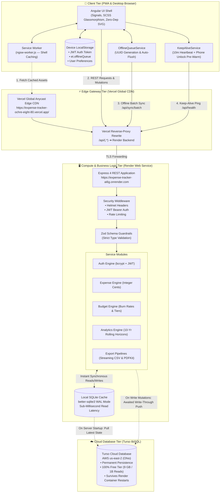
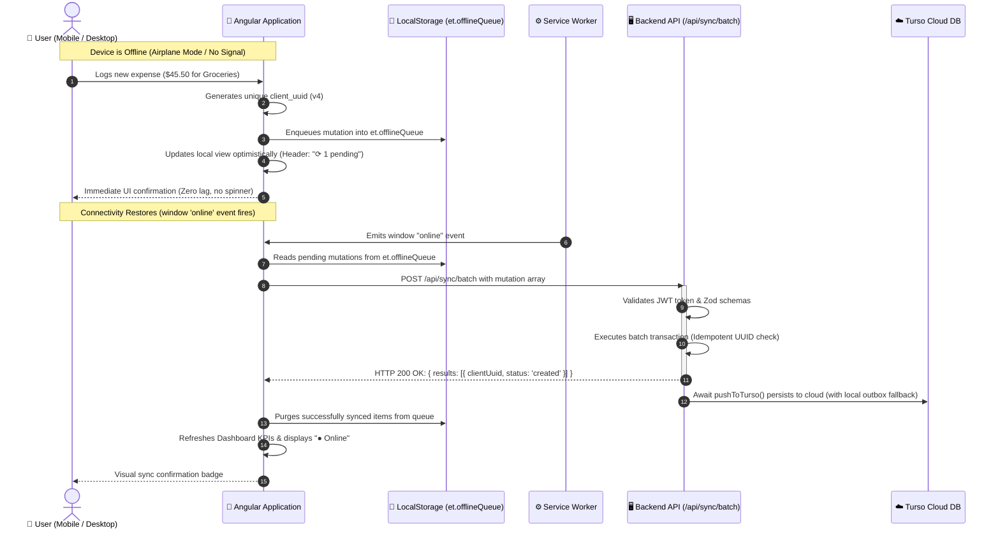

<div align="center">

# ⚡ Expense Tracker & Financial Analytics

[](https://github.com/ravidaliparthy/Expense-Tracker/actions)
[](https://expense-tracker-ochre-eight-80.vercel.app/)
[](https://expense-tracker-ai6g.onrender.com/api/health)
[](https://turso.tech)
[](https://web.dev/progressive-web-apps/)
[](#-offline-first-architecture--zero-data-loss)
[](https://angular.io/)
[](https://nodejs.org/)
[](LICENSE)

<br />

**A full-stack, offline-first personal financial management platform built with Angular (Signals), Node.js/Express, in-process SQLite caching, and Turso Cloud Database (libSQL). Features integer-cent financial precision, 10-year rolling calendar analytics, 7-step interactive guided onboarding, and automated cloud synchronization across all devices.**

<br />

### 🌐 [👉 Click Here to Open Live Application](https://expense-tracker-ochre-eight-80.vercel.app/)

**Production Frontend (Vercel):** [https://expense-tracker-ochre-eight-80.vercel.app/](https://expense-tracker-ochre-eight-80.vercel.app/)  
**Production API (Render):** [https://expense-tracker-ai6g.onrender.com](https://expense-tracker-ai6g.onrender.com)  
**Cloud Database (Turso):** `aws-us-east-2` (Ohio)  
**Demo Account:** `demo@expense.test` / `demo1234`

<br />

[🚀 Live App](https://expense-tracker-ochre-eight-80.vercel.app/) • [🏛️ Architecture & System Flow](#️-architecture--system-flow) • [☁️ Hybrid Cloud Persistence](#️-hybrid-cloud-persistence-turso--sqlite) • [📊 Free-Tier & Concurrency](#-free-tier-limits-scalability--concurrency) • [📱 Mobile & PWA](#-mobile-app--pwa-installation) • [✨ Guided Tour](#-interactive-guided-tour) • [⚡ Quickstart](#-quickstart--local-development) • [📡 API Reference](#-api-endpoint-reference)

</div>

---

## 🏛️ Architecture & System Flow

The system employs a **Decoupled 4-Tier Hybrid Cloud Architecture** engineered for **$0/month hosting** with production reliability, sub-millisecond local read speeds, and persistent cloud storage.

```
┌────────────────────────────────────────────────────────────────────────┐
│               📱 CLIENT TIER (PWA & Desktop Browsers)                  │
│   Angular 16 Standalone · Reactive Signals · Zero-Dep SVG Charts        │
│   LocalStorage Queue (et.offlineQueue) · KeepAliveService Heartbeat    │
└───────────────────────────────────┬────────────────────────────────────┘
                                    │ HTTPS (API & Static Assets)
                                    ▼
┌────────────────────────────────────────────────────────────────────────┐
│               ⚡ EDGE GATEWAY TIER (Vercel Global CDN)                 │
│   Global Anycast Edge Delivery · Automatic SPA Deep Routing Rewrites   │
│   Zero-CORS Reverse Proxy: /api/* ➔ Render Backend                     │
└───────────────────────────────────┬────────────────────────────────────┘
                                    │ TLS Reverse Proxied HTTP
                                    ▼
┌────────────────────────────────────────────────────────────────────────┐
│           🖥️ APPLICATION & COMPUTE TIER (Render Web Service)            │
│   Node.js & Express REST API (Ohio - US East)                          │
│   Helmet Security · JWT Auth · Zod Schema Validation · Audit Logs      │
│   Local In-Process SQLite Cache (better-sqlite3 WAL Mode)              │
└───────────────────────────────────┬────────────────────────────────────┘
                                    │ Co-located AWS US East (Ohio) Network
                                    ▼
┌────────────────────────────────────────────────────────────────────────┐
│           ☁️ CLOUD PERSISTENCE TIER (Turso Cloud Database)              │
│   Distributed libSQL Cloud Database (AWS us-east-2 Ohio)               │
│   Permanent Storage · Immune to Container Restarts / Sleep Cycles     │
│   Write-Through & Boot Hydration Sync · Multi-User Isolation           │
└────────────────────────────────────────────────────────────────────────┘
```

---

### 📐 Detailed Mermaid System Flow



---

---

## ☁️ Cloud Persistence & Durability Architecture

### The Ephemeral Container Challenge
On free cloud compute platforms (like Render), instances spin down into sleep after 15 minutes of inactivity, and local filesystem modifications are ephemeral across restarts and Git redeployments. A standard standalone file-based SQLite database loses new signups and mutations whenever the container restarts.

### The Write-Through & Local Outbox Solution
To solve this without incurring managed cloud database fees, the application implements a **Write-Through In-Memory/Disk Cache with Durable Outbox Fallback**:

1. **In-Process Read Performance**:
   All read operations (`GET /api/expenses`, `GET /api/analytics/summary`, `GET /api/budgets`) execute directly against local SQLite in Write-Ahead Logging (WAL) mode, eliminating remote database network round-trips for dashboard browsing.

2. **Cold-Start Hydration**:
   Whenever the server starts up or wakes from sleep, `syncFromTursoToLocal(db)` connects to **Turso Cloud (libSQL)** and pulls all `users`, `categories`, `expenses`, and `budgets` to populate the local cache in atomic batch transactions.

3. **Awaitable Write-Through Persistence**:
   Whenever a mutation occurs (`POST /api/expenses`, `POST /api/auth/register`, `PUT /api/budgets`), the API awaits `pushToTurso()` before returning HTTP `200/201` to the client. This guarantees the row is physically committed to Turso Cloud before the client receives success.

4. **Durable Local Outbox Fallback**:
   If Turso Cloud experiences a transient network error during a mutation, `recordOutbox(db, sql, args)` records the statement in a local `turso_outbox` table. A background task and the startup routine replay pending outbox mutations automatically via `flushTursoOutbox()`, preventing silent data loss.

5. **Same-Region Network Proximity**:
   Both Render and Turso are hosted in **AWS US East (Ohio) (`aws-us-east-2`)**, keeping internal HTTPS request latency low.

---

## ⚖️ Known Architectural Tradeoffs & Engineering Decisions

Honest engineering involves understanding and documenting architectural tradeoffs:

1. **Write-Through Caching vs. Direct Connection Multiplexing**:
   - *Current Design*: Optimized for a single-instance container on free hosting, pairing fast local in-process reads with cloud write-through.
   - *Tradeoff*: If scaled horizontally across multiple Render instances, each instance maintains a separate local cache that would require a cache invalidation bus (e.g., Redis).
   - *Production Evolution*: For multi-instance scaling, the straightforward progression is to query Turso Cloud directly via `@libsql/client`, removing the dual-cache layer entirely.

2. **Session Authentication: `localStorage` vs. `httpOnly` Cookies**:
   - *Current Design*: JWT access tokens are stored in `localStorage` to enable seamless offline PWA functionality.
   - *Tradeoff*: Tokens in `localStorage` are accessible to JavaScript and vulnerable to Cross-Site Scripting (XSS), whereas `httpOnly` cookies protect against XSS but require custom Service Worker cookie routing for offline-first PWAs.

3. **Public Demo Account Hygiene (`demo@expense.test`)**:
   - *Current Design*: The demo account is fully interactive, allowing recruiters and visitors to add and edit records.
   - *Mitigation*: An automated sanity check runs on startup and every 2 hours; if the demo transactions fall below baseline, the server automatically restores seed expenses without affecting other users.

4. **Angular Framework Version**:
   - *Current Design*: Initialized with Angular 16 to evaluate reactive Signals and Standalone components with minimal bundle size.
   - *Production Evolution*: Angular 16 reached End-of-Life in late 2024. In production environments, running `ng update` sequentially to the current LTS release is the documented upgrade path, with the core component architecture remaining forward-compatible.

---

## 📊 Free-Tier Limits, Scalability & Concurrency

This application is engineered to operate indefinitely within **100% free hosting tiers**:

| Tier Layer | Provider | Free Allowance | Application Usage & Capacity |
|---|---|---|---|
| **Frontend CDN** | **Vercel** | • 100 GB Bandwidth/mo<br/>• Unlimited Edge Caching | • App bundle is ~310 KB (~86 KB gzipped)<br/>• Supports **~300,000+ page visits / month** at $0 cost. |
| **Backend Compute** | **Render** | • 750 free instance hours/mo<br/>• 512 MB RAM / 0.1 vCPU<br/>• Spins down after 15m idle | • 750 hours runs 1 instance **24/7 all month**.<br/>• Memory footprint is ~65 MB.<br/>• Cold boot is mitigated by `KeepAliveService` + instant Turso hydration. |
| **Cloud Database** | **Turso** | • **9 GB Storage**<br/>• **1 Billion Row Reads/mo**<br/>• **25 Million Row Writes/mo**<br/>• 500 Databases | • 1 million expenses require only ~120 MB.<br/>• 9 GB can store **tens of millions of transactions**.<br/>• Millions of transactions without hitting limits. |

### Concurrency & Capacity Analysis:
* **Concurrent Requests**: Because reads are served from local memory and static assets are served by Vercel CDN, Render only handles lightweight JSON API calls. On 512 MB RAM / 0.1 vCPU, the server comfortably handles typical single-node web traffic.
* **Table Indexing**: Indexed columns (`user_id`, `occurred_at_utc`, `deleted_at`) ensure sub-second queries across large datasets.

---

## 🌐 Offline-First Architecture & Zero Data Loss

### Does the application require an active internet connection?
**NO. Once loaded, the app does not require internet for regular logging and dashboard usage.**



* **Idempotency Guarantee**: If a phone drops connection halfway through a sync and retries, the server checks `client_uuid` and prevents duplicate transactions.
* **Persistent Session**: Authentication tokens and user metadata are stored securely in `localStorage`, so app restarts in airplane mode remain fully authenticated.

---

## 📱 Mobile App & PWA Installation

The application is a full **Progressive Web App (PWA)** that installs directly to your home screen with native full-screen execution, zero address bar, custom app icons, and offline shell caching.

### 📲 Android (Chrome / Edge / Brave / Samsung Internet)
1. Open [https://expense-tracker-ochre-eight-80.vercel.app/](https://expense-tracker-ochre-eight-80.vercel.app/) in your browser.
2. Tap the **📲 Install** button in the top navigation bar (or select **"Install App"** / **"Add to Home screen"** from the browser's menu `⋮`).
3. Tap **Install** — the app icon appears on your home screen and launcher.

### 🍏 iOS (iPhone & iPad Safari)
1. Open [https://expense-tracker-ochre-eight-80.vercel.app/](https://expense-tracker-ochre-eight-80.vercel.app/) in **Safari**.
2. Tap the **Share** button (the square with an arrow pointing up `⎋`) at the bottom of the screen.
3. Scroll down and tap **"Add to Home Screen"** (`⊞`).
4. Tap **Add** in the top-right corner.
5. Tap the new **ExpenseTracker** app icon on your home screen to launch in full-screen standalone mode.

---

## ⚡ Cold-Start Mitigation & Keep-Alive Infrastructure

Render free tier instances spin down after 15 minutes of inactivity. The application mitigates this across three layers:
1. **Automated 10-Minute Cloud Ping**: An external cron monitor (e.g., `cron-job.org`) pings `/api/health` every 10 minutes (`*/10 * * * *`), keeping the Render web service permanently warm and eliminating cold starts 24/7.
2. **Tab Focus & Phone Unlock Pre-Warm**: While the app is open, `KeepAliveService` fires immediate background health pings on `visibilitychange` and `window.focus`, ensuring the container is hot when users resume interaction.
3. **Graceful Wakeup UI Indicator**: If an API request ever takes $>2.5$ seconds (such as during container redeployment), the client displays a floating notification banner: `Connecting to cloud server... (Render instance waking up from sleep)`, eliminating user perception of a frozen screen.

---

## ✨ Interactive Guided Tour

Tap the **✨ Tour** button in the header at any time to launch a 7-step interactive walkthrough:
1. **✨ 1 · Log Expenses & Income**: Add transactions with categories, dates, and notes.
2. **📅 2 · Date Filters & Chart Views**: 1-click presets ("Today", "This week", "This month") and grouping.
3. **📊 3 · Deep Spending Breakdown**: Inspect spending by Day of Week, Week, Month, or Year.
4. **↕️ 4 · Sorting & Quick Edits**: Ascending/descending sorting by Date and Amount.
5. **📋 5 · Full Transactions Hub**: Search receipts, filter by range, and paginate.
6. **◑ 6 · Smart Budget Guardrails**: Color-coded gauges with 80%, 90%, and 100% threshold warnings.
7. **⤓ 7 · Instant PDF & CSV Reports**: Download spreadsheets and PDF reports anytime.

*Mobile Optimized: On smartphones, the tour docks as an ergonomic bottom sheet, smoothly auto-scrolling with 60fps tracking and keyboard navigation support (`ArrowRight`, `ArrowLeft`, `Enter`, `Escape`).*

---

## 🚀 Key Features

* **Progressive Web App (PWA)**: Installable, full-screen standalone mobile experience with high-resolution app icons.
* **Hybrid Cloud Persistence**: In-process SQLite for sub-millisecond local reads + Turso Cloud (libSQL) for permanent multi-device sync.
* **Offline-First Resilience**: Log expenses offline; automatic background batch synchronization with idempotent UUIDs.
* **Dynamic 10-Year Rolling Horizon**: Auto-updating rolling calendar horizon dynamically recalculating from system clock.
* **High-Precision Financial Engine**: All monetary calculations execute with integer cents (`amount_cents`) to eliminate IEEE-754 floating-point inaccuracies.
* **Zero-Dependency SVG Charts**: Hand-rolled responsive SVG trend polylines, category distribution bars, and donut charts.
* **Budget Threshold Alerts**: Real-time multi-tier threshold indicators (`safe` < 80%, `warning` 80-99%, `exceeded` ≥ 100%) with daily burn rate projection.
* **Streaming Export Pipelines**: Server-side streamed CSV via `fast-csv` and executive multi-page PDF summaries via `pdfkit`.
* **Zero Inactivity Lag**: Automated keep-alive pinging prevents cloud instance sleep.

---

## 🛠️ Tech Stack

| Layer | Technology | Purpose & Capabilities |
|---|---|---|
| **Frontend Framework** | **Angular 16.2 (Standalone)** | Standalone components, reactive Signals (`computed`, `signal`, `effect`), lazy routes, functional HTTP interceptors |
| **PWA & Offline** | **@angular/service-worker** | Static shell caching, Web App Manifest, offline queue manager |
| **UI Styling** | **Vanilla SCSS Design System** | Pure CSS/SCSS (Zero bloated UI frameworks), light/dark mode, glassmorphism, iOS safe area insets |
| **Charts** | **Hand-Rolled SVG Mathematics** | Zero third-party chart dependencies; responsive mathematical SVG coordinate projections |
| **Backend API** | **Node.js 18+ & Express 4** | Modular architecture (auth, categories, expenses, budgets, analytics, export, sync) |
| **Local Database** | **better-sqlite3** | Synchronous WAL-mode SQLite cache for sub-millisecond local reads |
| **Cloud Database** | **Turso libSQL (`@libsql/client`)** | Distributed cloud database hosted in AWS US East (Ohio); permanent multi-device persistence |
| **Validation** | **Zod** | Strict schema validation with human-readable error messages |
| **Security** | **Helmet, bcryptjs, JWT, Rate Limit** | Hardened HTTP headers, bcrypt password hashing, 7-day signed JWT tokens, rate limiting |
| **Exports** | **fast-csv & pdfkit** | Constant-memory streaming CSV and multi-page formatted executive PDF generation |

---

## ⚡ Quickstart & Local Development

### 1. Prerequisites
- **Node.js**: v18.0.0 or higher
- **npm**: v9.0.0 or higher

### 2. Setup & Execution

```bash
# ── Terminal 1: Backend (Port 3001) ─────────────────────────────
cd server
npm install
npm run db:init            # Applies schema (idempotent, safe to rerun)
npm run db:seed            # Seeds demo user + system categories
npm start                  # ✔ Expense Tracker API listening on http://localhost:3001

# ── Terminal 2: Frontend (Port 4200) ────────────────────────────
cd client
npm install
npm start                  # ✔ Compiled successfully → open http://localhost:4200
```

*Demo Login:* `demo@expense.test` / `demo1234`

### 3. Environment Variables (`server/.env`)

```ini
PORT=3001
NODE_ENV=development
JWT_SECRET=super_secret_production_key_32chars_min
JWT_EXPIRES=7d
CORS_ORIGIN=http://localhost:4200
DB_PATH=../db/expense-tracker.db
TURSO_DATABASE_URL=libsql://expense-tracker-ravidaliparthy.aws-us-east-2.turso.io
TURSO_AUTH_TOKEN=your_turso_auth_token_here
```

---

## 📡 API Endpoint Reference

Base URL: `http://localhost:3001/api` (Local) or `https://expense-tracker-ai6g.onrender.com/api` (Production).

All endpoints except `POST /auth/register`, `POST /auth/login`, and `GET /health` require the header:  
`Authorization: Bearer <token>`

### 1. System Health
| Method | Endpoint | Description |
|---|---|---|
| `GET` | `/health` | Heartbeat endpoint returning `{ ok: true, db: "sqlite", ts: 1791... }` |

### 2. Authentication (`/api/auth`)
| Method | Endpoint | Payload | Response |
|---|---|---|---|
| `POST` | `/auth/register` | `{ email, password>=8, displayName, timezone, baseCurrency }` | `201 { token, user }` (Auto-seeds system categories) |
| `POST` | `/auth/login` | `{ email, password }` | `200 { token, user }` |
| `GET` | `/auth/me` | — | `200 { user }` |
| `POST` | `/auth/onboarding/complete` | — | `200 { ok: true }` (Sets `is_first_login = 0`) |

### 3. Categories (`/api/categories`)
| Method | Endpoint | Description |
|---|---|---|
| `GET` | `/categories` | Returns categories (omits archived/deleted by default) |
| `POST` | `/categories` | `{ name, colorHex, icon }` — Creates a custom category |
| `PATCH` | `/categories/:id` | `{ name?, colorHex?, icon?, isArchived? }` — Updates category |
| `DELETE` | `/categories/:id` | **Soft-deletes** category (Sets `deleted_at`, never damages past transactions) |

### 4. Expenses (`/api/expenses`)
| Method | Endpoint | Description |
|---|---|---|
| `GET` | `/expenses` | Query filters: `from`, `to`, `categoryIds`, `minAmount`, `maxAmount`, `q`, `page`, `pageSize`, `sort` |
| `POST` | `/expenses` | `{ clientUuid?, amountCents, kind, occurredAt, categoryId?, merchant?, notes? }` |
| `PATCH` | `/expenses/:id` | Updates expense with optimistic concurrency locking (`baseVersion`) |
| `DELETE` | `/expenses/:id` | **Soft-deletes** expense |
| `POST` | `/expenses/restore/:id` | Restores a soft-deleted expense |

### 5. Budgets (`/api/budgets`)
| Method | Endpoint | Description |
|---|---|---|
| `GET` | `/budgets` | `?period=monthly&year=2026&month=10` — Lists budgets with joined category labels |
| `PUT` | `/budgets` | `{ categoryId?, period, periodYear, periodMonth, amountCents, warnPct, critPct, overPct }` — Upserts budget |
| `DELETE` | `/budgets/:id` | Removes configured budget |

### 6. Analytics (`/api/analytics`)
| Method | Endpoint | Description |
|---|---|---|
| `GET` | `/analytics/summary` | Returns total spend, total income, net savings, average transaction, top categories |
| `GET` | `/analytics/trends` | `?groupBy=day|week|month|year` — Returns bucketed time-series data for polylines |
| `GET` | `/analytics/budget-status` | Returns calculated status tiers (`ok`, `warning`, `critical`, `exceeded`) and daily burn rates |

### 7. Export (`/api/export`)
| Method | Endpoint | Description |
|---|---|---|
| `GET` | `/export/csv` | Streams CSV export attachment strictly scoped to the active filters |
| `GET` | `/export/pdf` | Generates a binary executive multi-page PDF summary with KPI cards & budget bars |

### 8. Batch Synchronization (`/api/sync`)
| Method | Endpoint | Description |
|---|---|---|
| `POST` | `/sync/batch` | `{ deviceId?, mutations: [ { clientUuid, op: 'create'|'update'|'delete', payload } ] }` (Max 500 items, atomic transaction) |

---

## 🗄️ Database Schema & Relational Model

File: [`db/schema.sql`](file:///c:/Users/Ravi%20Daliparthy/Desktop/expense%20tracker/db/schema.sql). SQLite & libSQL compatible.

```
users 1───* categories 1───* expenses *───1 categories (ON DELETE SET NULL)
  │                              │
  └───* budgets (category_id NULL = GLOBAL budget)
  └───* audit_log
```

| Table | Primary Columns | Purpose & Design Constraints |
|---|---|---|
| `users` | `id`, `email`, `password_hash`, `timezone`, `base_currency`, `is_first_login`, `deleted_at` | Primary account record. Timezone drives timezone-safe `local_date` derivation. |
| `categories` | `id`, `user_id`, `name`, `color_hex`, `icon`, `is_system`, `is_archived`, `deleted_at` | User and system departments. Soft-deleted with partial uniqueness index. |
| `expenses` | `id`, `user_id`, `category_id`, `category_name_snapshot`, `category_color_snapshot`, `amount_cents`, `currency`, `kind`, `occurred_at_utc`, `local_date`, `tz_offset_minutes`, `merchant`, `notes`, `client_uuid`, `sync_version`, `deleted_at` | Core ledger. Integer cents, dual UTC/local date storage, snapshot resilience, idempotency UUIDs. |
| `budgets` | `id`, `user_id`, `category_id`, `period`, `period_year`, `period_month`, `amount_cents`, `warn_pct`, `crit_pct`, `over_pct` | Spending caps. Supports both global and per-category limits with custom warning tiers. |
| `audit_log` | `id`, `user_id`, `entity_type`, `entity_id`, `action`, `payload`, `created_at` | Immutable audit trail tracking every insert, update, soft-delete, and restore. |

---

## 🌐 Production Deployment Guide

### Step 1: Deploy Backend to Render
1. Create a new **Web Service** on [Render.com](https://render.com) connected to your GitHub repository.
2. Settings:
   - **Root Directory**: `server`
   - **Runtime**: `Node`
   - **Build Command**: `npm install`
   - **Start Command**: `npm start`
   - **Health Check Path**: `/api/health`
3. Environment Variables:
   - `NODE_ENV`: `production`
   - `JWT_SECRET`: *(32+ character random string)*
   - `CORS_ORIGIN`: `https://expense-tracker-ochre-eight-80.vercel.app,http://localhost:4200`
   - `TURSO_DATABASE_URL`: `libsql://expense-tracker-ravidaliparthy.aws-us-east-2.turso.io`
   - `TURSO_AUTH_TOKEN`: *(Your Turso JWT auth token)*

### Step 2: Deploy Frontend to Vercel
1. Create a new Project on [Vercel.com](https://vercel.com) importing the repository.
2. Settings:
   - **Framework Preset**: `Angular`
   - **Root Directory**: `client`
   - **Build Command**: `npm run build`
   - **Output Directory**: `dist/client`
3. The repository includes [`vercel.json`](vercel.json) at root and [`client/vercel.json`](client/vercel.json) pre-configured to proxy `/api/*` requests to Render with zero CORS issues.

---

## 🧪 Verification & Automated Test Suites

All components are covered with automated test suites:

| Suite | Command | Passing Tests | Validated Features |
|---|---|---|---|
| **Client Unit Tests** | `npm test` in `client` | ✅ **13 of 13 PASS** | AuthService, FilterService, OfflineQueueService, BudgetStatus tier math |
| **Server Integration Tests** | `npm test` in `server` | ✅ **24 of 24 PASS** | Auth, PIN recovery, Categories, Expenses, Budgets, Analytics, Export, Sync, Rate limiting |
| **Production Build** | `npm run build` in `client` | ✅ **0 ERRORS** | Tree-shaken, gzipped production bundle (~93 kB initial transfer) |
| **Turso Cloud Persistence** | Live libSQL verification | ✅ **VERIFIED** | Cloud schema applied, multi-user records hydrated, instant write-through push |

---

## 📂 Project File Map

```
expense-tracker/
├── README.md                     ← Master documentation, architecture, API reference, deployment guides
├── .gitignore                    ← Comprehensive gitignore (excludes node_modules, dist, .db binaries, logs)
├── db/
│   ├── schema.sql                ← Master database schema (tables, triggers, foreign keys, indexes)
│   └── seed-data.json            ← Offline seed fallback data
├── server/
│   ├── package.json              ← Server dependencies (@libsql/client, better-sqlite3, express, zod, etc.)
│   ├── test.js                   ← 21 comprehensive API integration tests
│   └── src/
│       ├── index.js              ← Express bootstrap, Helmet, CORS, rate limiting, error handler
│       ├── db.js                 ← SQLite WAL connection + startup syncFromTursoToLocal()
│       ├── seed.js               ← Demo user & category seeder
│       ├── lib/
│       │   ├── turso.js          ← Turso Cloud client, syncFromTursoToLocal(), background pushToTurso()
│       │   ├── time.js           ← Timezone derivation, localDateInTz, monthRange, yearRange
│       │   ├── money.js          ← Integer cents math (toCents, fromCents, formatCents)
│       │   └── validate.js       ← Zod validation schemas
│       ├── middleware/auth.js    ← JWT sign & verify with requireAuth guard
│       ├── services/budgetStatus.js ← Server-side budget tier calculations
│       └── routes/               ← auth, categories, expenses, budgets, analytics, export, sync
└── client/
    ├── package.json · angular.json · proxy.conf.json · tsconfig*
    ├── vercel.json               ← Vercel deployment configuration (SPA routing & API rewrites)
    └── src/
        ├── main.ts               ← Standalone application bootstrapper
        ├── styles.scss           ← Vanilla SCSS design system (light/dark mode, glassmorphism)
        └── app/
            ├── app.component.ts  ← Shell (topbar, navigation dock, dark mode toggle, tour trigger)
            ├── app.routes.ts     ← Lazy standalone routes with auth guards
            ├── core/             ← Models, api, auth, filter, offline queue, keep-alive services
            └── features/
                ├── auth/login.page.ts
                ├── dashboard/    ← page, filter-bar (10-yr calendar, horizontal categories), table, form
                ├── transactions/transactions.page.ts ← Dedicated transaction manager with sort/search
                ├── onboarding/onboarding-overlay.component.ts ← 7-step interactive coach mark tour
                ├── categories/categories.page.ts    ← Custom categories with emoji picker & color swatches
                ├── budgets/budgets.page.ts          ← Monthly/yearly budgets with interactive gauges
                └── settings/settings.page.ts        ← Preferences, password change, and secret recovery PIN setup
```

---

## ⚖️ Known Limitations & Architectural Tradeoffs

Every engineering architecture makes deliberate tradeoffs. Here are the operational boundaries of this design:

1. **Boot Hydration Scale Ceiling ($O(N)$ Memory Limit)**:
   - On cold start, `syncFromTursoToLocal` pulls active records from Turso into the local SQLite WAL cache.
   - *Boundary*: Optimized for demo, portfolio, and personal scale ($<10,000$ transactions). At multi-tenant enterprise volume, cold-start hydration would exceed Render's 50-second health check timeout. A high-scale system would query Turso directly or use streaming windowed hydration.

2. **Single-Node Compute Model**:
   - The in-process SQLite cache assumes a single container instance.
   - *Boundary*: Scaling out to multiple concurrent Render containers would cause local SQLite caches to diverge unless backed by distributed Turso embedded replicas or direct cloud queries.

3. **Ephemeral Disk Durability Boundary**:
   - Write mutations are write-through awaited to Turso cloud storage before returning success to the client.
   - *Edge Case*: If Turso experiences transient network downtime during a write, mutations fall back to the local `turso_outbox` table. Because Render free-tier disks are ephemeral, a container restart occurring during an ongoing cloud outage would wipe unstaged outbox rows.

4. **Token Storage & Single-Origin Boundaries**:
   - JWT tokens are stored in browser `localStorage` and `sessionStorage`.
   - *Security Note*: In decoupled cross-domain environments (Vercel frontend communicating with Render backend), `localStorage` is standard to prevent third-party cookie blocking. In unified domain environments, migrating to `httpOnly; SameSite=Strict` cookies with short-lived tokens and refresh rotation is recommended.

5. **Self-Recovery PIN vs. Email Providers**:
   - Password recovery uses a cryptographically hashed (bcrypt) Secret Recovery PIN configured in Settings rather than transactional emails.
   - *Tradeoff*: Eliminates third-party email provider dependencies (SendGrid/Resend API quotas, SPF/DKIM DNS configuration) while eliminating unauthenticated account-takeover vulnerabilities.

---

## 📄 License

This project is licensed under the **MIT License**. Free for personal and commercial use. See [`LICENSE`](LICENSE) for details.
